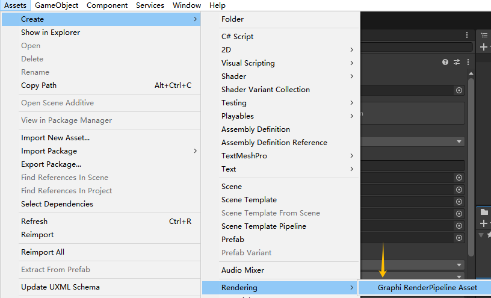
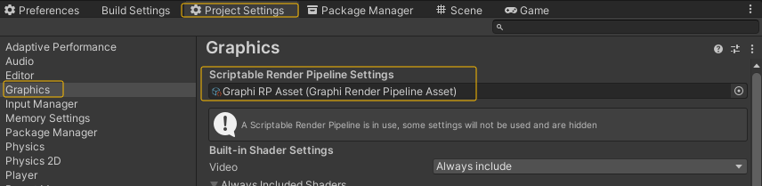

# Graphi RenderPipeline 文档

>
## 目录结构

> Documentation（文档）

> Runtime（运行时）

> CHANGELOG.md （日志）

> LICENSE.md （许可）

> README.md （自述）

> package.json（配置）

## 部署 
> 前往菜单栏，选择 **Assets/Create/Rendering/Graphi RenderPipeline Asset** ，创建自定义渲染管线配置。

> 

> 再选择菜单栏 **Edit/Project Settings** 打开工程设置面板，找到 ***Graphics*** 页签。 将刚才生成的管线配置拖入至 ***Scriptable Render Pipeline Settings*** 的下方对象框内。
> 
> 

> 到此 Graphi RenderPipeline 渲染管线设置完毕.

## 其他
##### **[关于 CN.Graphi](https://github.com/qnstd)**