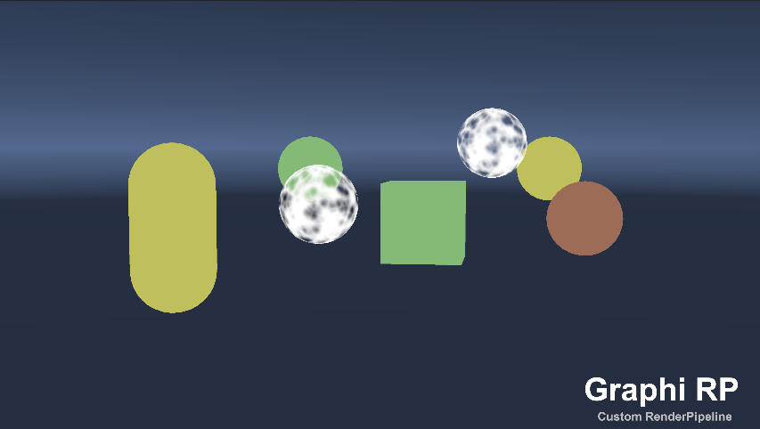

# Graphi RenderPipeline
#

## 说明
> 这是一套自定义渲染管线。其中包含非透明、半透明、天空盒、UI、Gizmos 等基础相关对象的渲染，同时支持多相机的渲染操作。详细内容请查看教程及日志。
> 
> ***目前仅支持无光照渲染着色方案***

> Unity版本建议使用 ***2022.3.21f1c1*** 及以上长期支持版本。

#

## 教程及日志
> 详细教程及相关操作说明请查看 ***[帮助文档](https://github.com/qnstd/RenderingHDRP/blob/master/Documentation/graphi_rendering_hdrp.md)***

> 版本迭代请查看 ***[更新日志](https://github.com/qnstd/RenderingHDRP/blob/master/CHANGELOG.md)***

#

## 渲染示例

> 
